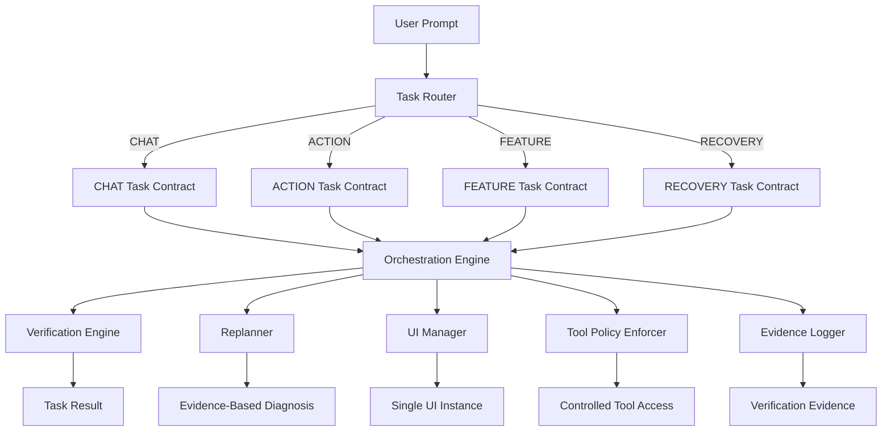
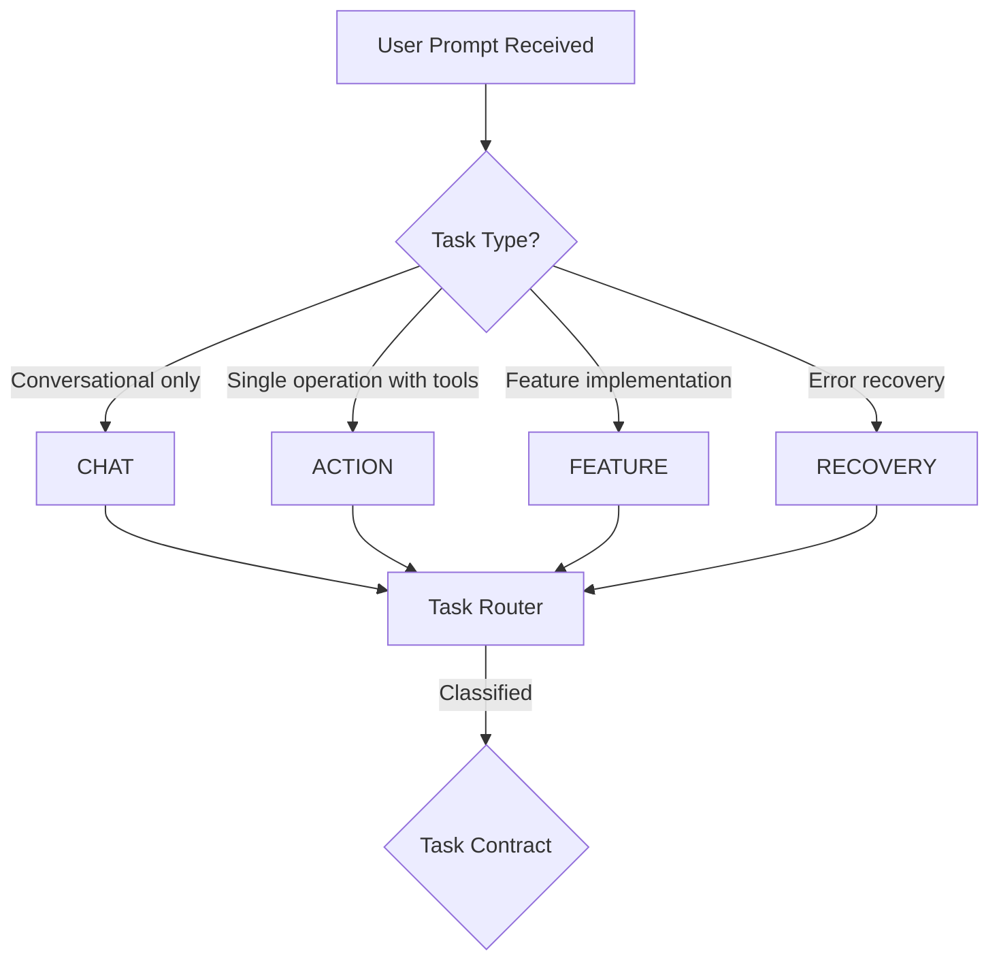
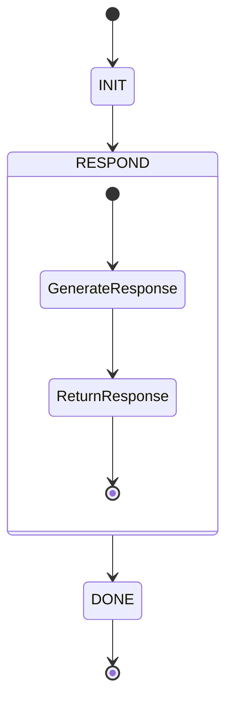
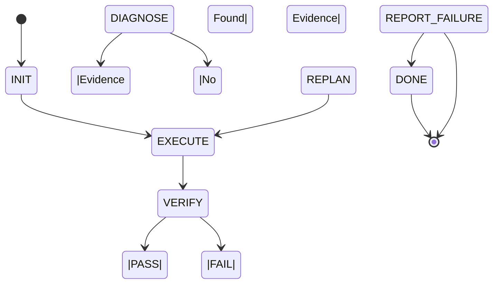
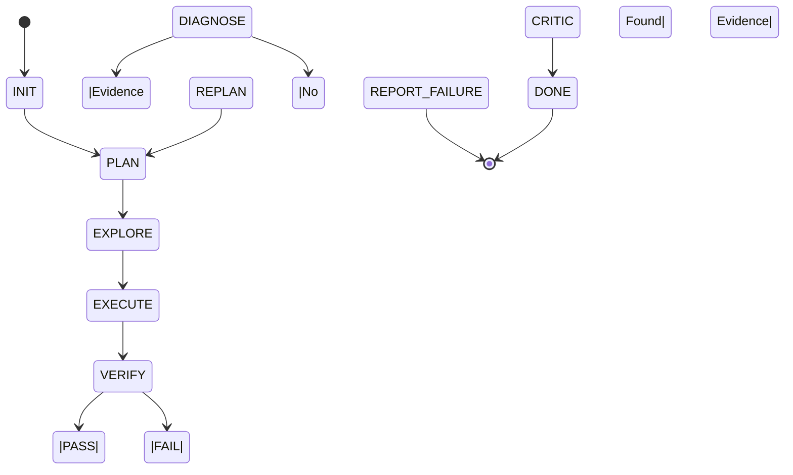
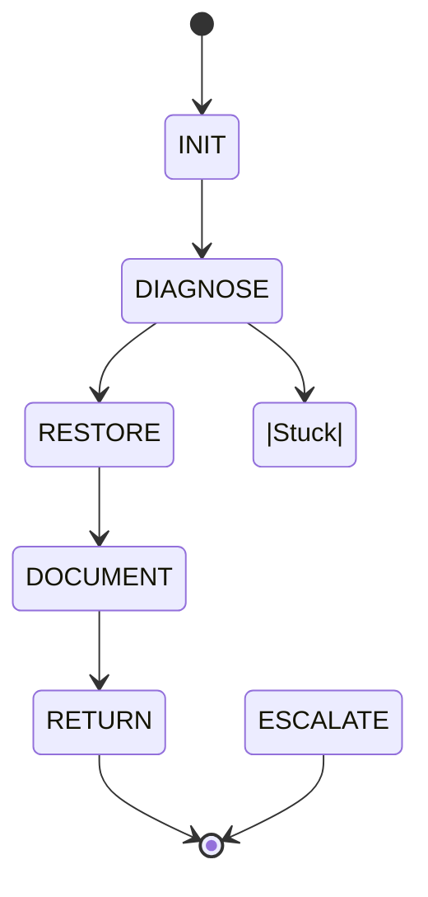

# Design Document: CodeAgent SDD Contract

## Overview

This document defines the technical design for the CodeAgent SDD (Software Development Design) contract system. CodeAgent is a local AI-powered code agent platform that executes tasks through a supervisor orchestration layer. This design addresses four key bugs that have recurred in production:

1. **Unexpected UI windows** - The agent creates new UI instances when it should only maintain one per session
2. **Unnecessary verification** - The agent triggers verification for tasks that don't require it
3. **Replanning without evidence** - The agent replans based on assumptions rather than concrete failure proof
4. **Tests running when not requested** - The agent executes tests when not explicitly part of the task

The design implements a contract-based system with formal task classification, enforcement of behavioral boundaries per task type, evidence-based verification, and bounded execution patterns.

## Architecture



### Component Responsibilities

| Component | Responsibility | Key Guarantees |
|-----------|----------------|----------------|
| **Task Router** | Classifies incoming prompts into CHAT, ACTION, FEATURE, or RECOVERY | Exactly one classification per task |
| **CHAT Task Contract** | Enforces conversational behavior | No filesystem, no terminal, no verification, no replanning |
| **ACTION Task Contract** | Enforces minimal tool usage | Only requested tools, verify only requested, zero replans on success |
| **FEATURE Task Contract** | Enforces structured workflow | PLAN → EXPLORE → EXECUTE → VERIFY → DIAGNOSE/REPLAN |
| **RECOVERY Task Contract** | Enforces state restoration | Restore state, document recovery |
| **Verification Engine** | Validates results against criteria | PASS/NOT_REQUIRED/FAIL/ERROR states with evidence |
| **Replanner** | Plans alternative approaches | Evidence-only triggers, bounded count |
| **UI Manager** | Manages UI lifecycle | Single instance per session, no new windows |
| **Tool Policy Enforcer** | Controls tool access by task type | Rejects unauthorized tool usage |
| **Evidence Logger** | Records verification results | Concrete proof with expected vs actual |

## High-Level Design

### Task Classification System

Tasks are classified using a decision tree based on prompt characteristics:

1. **CHAT** - Pure conversational requests, no actions needed
2. **ACTION** - Single-step operations requiring minimal tools
3. **FEATURE** - Multi-phase feature implementation requiring full workflow
4. **RECOVERY** - Error recovery and state restoration



### Workflow State Machines

#### CHAT Task State Machine



**Transitions:**
- `INIT → RESPOND`: Prompt classified as CHAT, begin response generation
- `RESPOND → DONE`: Response generated and delivered, task complete

**Guarantees:**
- No filesystem access
- No terminal command execution
- No verification triggered
- No replanning possible

---

#### ACTION Task State Machine



**Transitions:**
- `INIT → EXECUTE`: Task classified as ACTION, execute minimal tools
- `EXECUTE → VERIFY`: Execution complete, verify requested criteria
- `VERIFY → DONE`: All verification criteria PASS
- `VERIFY → DIAGNOSE`: Verification FAIL, gather evidence
- `DIAGNOSE → REPLAN`: Evidence gathered, create new plan
- `DIAGNOSE → REPORT_FAILURE`: No evidence found, report uncertainty
- `REPLAN → EXECUTE`: New plan created, retry execution

**Guarantees:**
- Only necessary tools used
- Only explicitly requested verification
- Zero replans on first-success
- Evidence required before replanning

---

#### FEATURE Task State Machine



**Transitions:**
- `INIT → PLAN`: Feature task identified, create high-level plan
- `PLAN → EXPLORE`: Explore codebase, understand existing patterns
- `EXPLORE → EXECUTE`: Implement solution based on plan
- `EXECUTE → VERIFY`: Verify implementation against acceptance criteria
- `VERIFY → CRITIC`: Verification PASS, invoke critic for review
- `VERIFY → DIAGNOSE`: Verification FAIL, gather evidence
- `DIAGNOSE → REPLAN`: Evidence gathered, revise plan
- `REPLAN → PLAN`: New plan created, restart workflow
- `DIAGNOSE → REPORT_FAILURE`: No evidence found, report uncertainty

**Guarantees:**
- Strict workflow enforcement
- No skipping VERIFY phase
- Evidence required before DIAGNOSE → REPLAN
- CRITIC invoked after successful verification

---

#### RECOVERY Task State Machine



**Transitions:**
- `INIT → DIAGNOSE`: Recovery task identified, analyze failure state
- `DIAGNOSE → RESTORE`: Diagnosis complete, restore to known-good state
- `RESTORE → DOCUMENT`: State restored, document what happened
- `DOCUMENT → RETURN`: Documentation complete, return to normal execution
- `DIAGNOSE → ESCALATE`: Cannot diagnose, escalate to human

**Guarantees:**
- Restore system state to known-good condition
- Document recovery process and changes
- No requirements modification beyond recovery necessity

---

## Components and Interfaces

### Task Router Interface

```python
from enum import Enum
from dataclasses import dataclass
from typing import Optional, Dict, Any


class TaskType(Enum):
    CHAT = "CHAT"
    ACTION = "ACTION"
    FEATURE = "FEATURE"
    RECOVERY = "RECOVERY"


@dataclass
class TaskClassification:
    task_type: TaskType
    confidence: float
    classification_reason: str
    metadata: Dict[str, Any]


class TaskRouter:
    """Classifies incoming prompts into task types"""
    
    def classify(self, prompt: str, context: Dict[str, Any]) -> TaskClassification:
        """
        Classify a user prompt into a task type.
        
        Args:
            prompt: The user's input prompt
            context: Additional context about the session
            
        Returns:
            TaskClassification with type, confidence, and reasoning
            
        Raises:
            ValueError: If classification confidence is too low
        """
        raise NotImplementedError
    
    def _extract_indicators(self, prompt: str) -> Dict[str, Any]:
        """
        Extract classification indicators from prompt.
        
        Returns:
            Dictionary of indicator names and values
        """
        raise NotImplementedError
    
    def _apply_decision_rules(self, indicators: Dict[str, Any]) -> TaskType:
        """
        Apply decision rules to determine task type.
        
        Returns:
            The determined TaskType
        """
        raise NotImplementedError
```

### Task Contract Interface

```python
from abc import ABC, abstractmethod
from typing import Protocol, List, Set
from enum import Enum


class ToolType(Enum):
    FILESYSTEM = "filesystem"
    TERMINAL = "terminal"
    VERIFICATION = "verification"
    REPLANNING = "replanning"
    CONVERSATION = "conversation"
    UI = "ui"


class VerificationResult(Enum):
    PASS = "PASS"
    NOT_REQUIRED = "NOT_REQUIRED"
    FAIL = "FAIL"
    ERROR = "ERROR"


class TaskContract(ABC):
    """Base interface for all task contracts"""
    
    @abstractmethod
    def get_allowed_tools(self) -> Set[ToolType]:
        """Return set of tools allowed for this task type"""
        raise NotImplementedError
    
    @abstractmethod
    def can_verify(self) -> bool:
        """Return True if verification is allowed for this task"""
        raise NotImplementedError
    
    @abstractmethod
    def can_replan(self) -> bool:
        """Return True if replanning is allowed for this task"""
        raise NotImplementedError
    
    @abstractmethod
    def get_max_iterations(self) -> int:
        """Return maximum iterations for this task type"""
        raise NotImplementedError


class ChatTaskContract(TaskContract):
    """Contract for CHAT tasks - conversational only"""
    
    def get_allowed_tools(self) -> Set[ToolType]:
        return {ToolType.CONVERSATION}
    
    def can_verify(self) -> bool:
        return False
    
    def can_replan(self) -> bool:
        return False
    
    def get_max_iterations(self) -> int:
        return 1


class ActionTaskContract(TaskContract):
    """Contract for ACTION tasks - minimal tools, single operation"""
    
    def get_allowed_tools(self) -> Set[ToolType]:
        return {ToolType.CONVERSATION, ToolType.TERMINAL, ToolType.FILESYSTEM}
    
    def can_verify(self) -> bool:
        return True  # Only if explicitly requested
    
    def can_replan(self) -> bool:
        return True  # Only after evidence gathered
    
    def get_max_iterations(self) -> int:
        return 3


class FeatureTaskContract(TaskContract):
    """Contract for FEATURE tasks - full workflow"""
    
    def get_allowed_tools(self) -> Set[ToolType]:
        return {
            ToolType.CONVERSATION,
            ToolType.TERMINAL,
            ToolType.FILESYSTEM,
            ToolType.VERIFICATION,
            ToolType.REPLANNING,
            ToolType.UI
        }
    
    def can_verify(self) -> bool:
        return True
    
    def can_replan(self) -> bool:
        return True
    
    def get_max_iterations(self) -> int:
        return 5


class RecoveryTaskContract(TaskContract):
    """Contract for RECOVERY tasks - state restoration"""
    
    def get_allowed_tools(self) -> Set[ToolType]:
        return {
            ToolType.CONVERSATION,
            ToolType.TERMINAL,
            ToolType.FILESYSTEM,
            ToolType.UI
        }
    
    def can_verify(self) -> bool:
        return True
    
    def can_replan(self) -> bool:
        return True
    
    def get_max_iterations(self) -> int:
        return 4
```

### Verification Engine Interface

```python
from dataclasses import dataclass
from typing import List, Optional
from enum import Enum


class VerificationState(Enum):
    PASS = "PASS"
    NOT_REQUIRED = "NOT_REQUIRED"
    FAIL = "FAIL"
    ERROR = "ERROR"


@dataclass
class VerificationCriterion:
    name: str
    required: bool
    description: str
    expected: str
    actual: Optional[str] = None
    evidence: Optional[str] = None


@dataclass
class VerificationResult:
    state: VerificationState
    criteria: List[VerificationCriterion]
    success: bool
    evidence: str


class VerificationEngine:
    """Validates task results against acceptance criteria"""
    
    def verify(
        self,
        criteria: List[VerificationCriterion],
        results: Dict[str, Any]
    ) -> VerificationResult:
        """
        Verify results against criteria.
        
        Args:
            criteria: List of verification criteria
            results: Actual results from task execution
            
        Returns:
            VerificationResult with overall state and evidence
        """
        raise NotImplementedError
    
    def compute_success(self, criteria: List[VerificationCriterion]) -> bool:
        """
        Compute overall success based on criteria states.
        
        Returns:
            True if all required criteria are PASS
        """
        required_criteria = [c for c in criteria if c.required]
        if not required_criteria:
            return True
        
        return all(c.state == VerificationState.PASS for c in required_criteria)
    
    def gather_evidence(
        self,
        criterion: VerificationCriterion,
        expected: str,
        actual: str
    ) -> str:
        """
        Gather concrete evidence for verification failure.
        
        Returns:
            Detailed evidence string with difference analysis
        """
        raise NotImplementedError
```

### Replanner Interface

```python
from dataclasses import dataclass
from typing import List, Optional
from enum import Enum


@dataclass
class Diagnosis:
    problem: str
    evidence: str
    root_cause: str
    suggested_changes: List[str]


@dataclass
class Plan:
    steps: List[str]
    tools_needed: List[str]
    expected_outcome: str


class Replanner:
    """Plans alternative approaches based on evidence"""
    
    def __init__(self, max_replans: int = 2):
        self.max_replans = max_replans
    
    def should_replan(
        self,
        task_type: str,
        diagnosis: Optional[Diagnosis],
        replan_count: int
    ) -> bool:
        """
        Determine if replanning should occur.
        
        Args:
            task_type: Type of task being executed
            diagnosis: Evidence-based diagnosis (if available)
            replan_count: Number of replans so far
            
        Returns:
            True if replanning should proceed
        """
        # ACTION tasks: replan only after evidence gathered
        if task_type == "ACTION":
            return diagnosis is not None and replan_count < self.max_replans
        
        # FEATURE tasks: replan only after DIAGNOSE phase with evidence
        if task_type == "FEATURE":
            return diagnosis is not None and replan_count < self.max_replans
        
        # Other task types
        return diagnosis is not None and replan_count < self.max_replans
    
    def generate_plan(
        self,
        diagnosis: Diagnosis,
        previous_plan: Plan
    ) -> Plan:
        """
        Generate new plan based on diagnosis.
        
        Args:
            diagnosis: Evidence-based diagnosis of failure
            previous_plan: The plan that failed
            
        Returns:
            New revised plan
        """
        raise NotImplementedError
    
    def document_change(
        self,
        previous: Plan,
        new: Plan,
        diagnosis: Diagnosis
    ) -> str:
        """
        Document what changed and why.
        
        Returns:
            Detailed change documentation
        """
        raise NotImplementedError
```

### UI Manager Interface

```python
from dataclasses import dataclass
from typing import Optional
from enum import Enum


class UIState(Enum):
    OPEN = "OPEN"
    CLOSED = "CLOSED"
    TERMINATED = "TERMINATED"


@dataclass
class UIInstance:
    id: str
    state: UIState
    type: str
    session_id: str


class UIManager:
    """Manages UI lifecycle with single-instance policy"""
    
    def __init__(self):
        self.instance: Optional[UIInstance] = None
        self.max_instances = 1
    
    def create_instance(
        self,
        session_id: str,
        ui_type: str
    ) -> UIInstance:
        """
        Create a new UI instance.
        
        Args:
            session_id: The current session ID
            ui_type: Type of UI to create
            
        Returns:
            The created UI instance
            
        Raises:
            ValueError: If max instances would be exceeded
        """
        if self.instance is not None:
            if self.instance.state == UIState.CLOSED:
                # Close old instance, create new
                self.instance.state = UIState.TERMINATED
                self.instance = self._create_internal(session_id, ui_type)
            else:
                raise ValueError("UI instance already exists for this session")
        else:
            self.instance = self._create_internal(session_id, ui_type)
        
        return self.instance
    
    def update_instance(self, ui_instance: UIInstance) -> None:
        """
        Update an existing UI instance.
        Does NOT create new instances.
        
        Args:
            ui_instance: Updated UI instance data
        """
        if self.instance is None:
            raise ValueError("No UI instance exists")
        
        self.instance.state = ui_instance.state
        self.instance.type = ui_instance.type
    
    def close_instance(self) -> None:
        """Mark the UI instance as closed"""
        if self.instance:
            self.instance.state = UIState.CLOSED
    
    def terminate_session(self) -> None:
        """Mark the session as terminated"""
        if self.instance:
            self.instance.state = UIState.TERMINATED
            self.instance = None
    
    def _create_internal(
        self,
        session_id: str,
        ui_type: str
    ) -> UIInstance:
        """Internal method to create UI instance"""
        raise NotImplementedError
```

### Tool Policy Enforcer Interface

```python
from dataclasses import dataclass
from typing import Set
from enum import Enum


class ToolType(Enum):
    FILESYSTEM = "filesystem"
    TERMINAL = "terminal"
    VERIFICATION = "verification"
    REPLANNING = "replanning"
    CONVERSATION = "conversation"
    UI = "ui"
    TEST_RUNNER = "test_runner"
    DEBUGGER = "debugger"


@dataclass
class ToolPolicy:
    task_type: str
    allowed_tools: Set[ToolType]
    blocked_tools: Set[ToolType]


class ToolPolicyEnforcer:
    """Controls tool access by task type"""
    
    def __init__(self):
        self.policies = self._initialize_policies()
    
    def _initialize_policies(self) -> Dict[str, ToolPolicy]:
        """Initialize tool policies for each task type"""
        return {
            "CHAT": ToolPolicy(
                task_type="CHAT",
                allowed_tools={ToolType.CONVERSATION},
                blocked_tools={
                    ToolType.FILESYSTEM,
                    ToolType.TERMINAL,
                    ToolType.VERIFICATION,
                    ToolType.REPLANNING,
                    ToolType.UI,
                    ToolType.TEST_RUNNER,
                    ToolType.DEBUGGER
                }
            ),
            "ACTION": ToolPolicy(
                task_type="ACTION",
                allowed_tools={ToolType.CONVERSATION, ToolType.TERMINAL, ToolType.FILESYSTEM},
                blocked_tools={
                    ToolType.VERIFICATION,  # Only if explicitly requested
                    ToolType.REPLANNING,
                    ToolType.UI,
                    ToolType.TEST_RUNNER,
                    ToolType.DEBUGGER
                }
            ),
            "FEATURE": ToolPolicy(
                task_type="FEATURE",
                allowed_tools={
                    ToolType.CONVERSATION,
                    ToolType.TERMINAL,
                    ToolType.FILESYSTEM,
                    ToolType.VERIFICATION,
                    ToolType.REPLANNING,
                    ToolType.UI,
                    ToolType.TEST_RUNNER,
                    ToolType.DEBUGGER
                },
                blocked_tools=set()
            ),
            "RECOVERY": ToolPolicy(
                task_type="RECOVERY",
                allowed_tools={
                    ToolType.CONVERSATION,
                    ToolType.TERMINAL,
                    ToolType.FILESYSTEM,
                    ToolType.UI
                },
                blocked_tools={
                    ToolType.VERIFICATION,
                    ToolType.REPLANNING,
                    ToolType.TEST_RUNNER,
                    ToolType.DEBUGGER
                }
            )
        }
    
    def is_tool_allowed(
        self,
        task_type: str,
        tool_type: ToolType
    ) -> bool:
        """
        Check if a tool is allowed for a task type.
        
        Args:
            task_type: The task type being executed
            tool_type: The tool being requested
            
        Returns:
            True if tool is allowed
        """
        policy = self.policies.get(task_type)
        if not policy:
            return False
        
        return tool_type in policy.allowed_tools
    
    def get_allowed_tools(self, task_type: str) -> Set[ToolType]:
        """Get all allowed tools for a task type"""
        policy = self.policies.get(task_type)
        return policy.allowed_tools if policy else set()
```

### Evidence Logger Interface

```python
from dataclasses import dataclass
from typing import List, Optional
from datetime import datetime
from enum import Enum


class EvidenceType(Enum):
    VERIFICATION_FAIL = "VERIFICATION_FAIL"
    VERIFICATION_ERROR = "VERIFICATION_ERROR"
    DIAGNOSIS = "DIAGNOSIS"
    REPLAN = "REPLAN"


@dataclass
class Evidence:
    evidence_type: EvidenceType
    timestamp: datetime
    task_id: str
    description: str
    expected: str
    actual: str
    difference: str
    additional_context: Optional[str] = None


class EvidenceLogger:
    """Records concrete proof of verification results"""
    
    def __init__(self):
        self.evidence_log: List[Evidence] = []
    
    def log_verification_fail(
        self,
        task_id: str,
        criterion_name: str,
        expected: str,
        actual: str,
        difference: str
    ) -> Evidence:
        """
        Log a verification failure with evidence.
        
        Args:
            task_id: ID of the task
            criterion_name: Name of the failed criterion
            expected: Expected outcome
            actual: Actual outcome
            difference: Analysis of difference
            
        Returns:
            The logged Evidence object
        """
        evidence = Evidence(
            evidence_type=EvidenceType.VERIFICATION_FAIL,
            timestamp=datetime.now(),
            task_id=task_id,
            description=f"Verification failed for criterion: {criterion_name}",
            expected=expected,
            actual=actual,
            difference=difference
        )
        self.evidence_log.append(evidence)
        return evidence
    
    def log_verification_error(
        self,
        task_id: str,
        error_message: str,
        stack_trace: Optional[str] = None
    ) -> Evidence:
        """
        Log a verification error.
        
        Args:
            task_id: ID of the task
            error_message: Error message from verification
            stack_trace: Optional stack trace
            
        Returns:
            The logged Evidence object
        """
        evidence = Evidence(
            evidence_type=EvidenceType.VERIFICATION_ERROR,
            timestamp=datetime.now(),
            task_id=task_id,
            description="Verification encountered an error",
            expected="Verification to complete successfully",
            actual=error_message,
            difference="Exception occurred during verification",
            additional_context=stack_trace
        )
        self.evidence_log.append(evidence)
        return evidence
    
    def log_diagnosis(
        self,
        task_id: str,
        problem: str,
        root_cause: str,
        evidence: str
    ) -> Evidence:
        """
        Log a diagnosis with evidence.
        
        Args:
            task_id: ID of the task
            problem: The problem identified
            root_cause: Root cause analysis
            evidence: Supporting evidence
            
        Returns:
            The logged Evidence object
        """
        evidence_obj = Evidence(
            evidence_type=EvidenceType.DIAGNOSIS,
            timestamp=datetime.now(),
            task_id=task_id,
            description=f"Diagnosis: {problem}",
            expected="Task to succeed",
            actual=f"Root cause: {root_cause}",
            difference=evidence
        )
        self.evidence_log.append(evidence_obj)
        return evidence_obj
    
    def get_evidence_for_task(self, task_id: str) -> List[Evidence]:
        """Get all evidence for a specific task"""
        return [e for e in self.evidence_log if e.task_id == task_id]
    
    def get_recent_evidence(self, limit: int = 10) -> List[Evidence]:
        """Get most recent evidence entries"""
        return sorted(
            self.evidence_log,
            key=lambda e: e.timestamp,
            reverse=True
        )[:limit]
```

## Data Models

### Task Data Model

```python
from dataclasses import dataclass
from typing import Dict, List, Optional, Any
from datetime import datetime
from enum import Enum


class TaskStatus(Enum):
    INITIALIZED = "INITIALIZED"
    RUNNING = "RUNNING"
    VERIFIED = "VERIFIED"
    FAILED = "FAILED"
    RECOVERED = "RECOVERED"
    TERMINATED = "TERMINATED"


@dataclass
class Task:
    id: str
    prompt: str
    task_type: str  # CHAT, ACTION, FEATURE, RECOVERY
    status: TaskStatus
    workflow_phase: str  # INIT, PLAN, EXPLORE, EXECUTE, VERIFY, DIAGNOSE, REPLAN, etc.
    tools_used: List[str]
    verification_results: Dict[str, str]  # criterion_name -> PASS/FAIL/ERROR/NOT_REQUIRED
    evidence_ids: List[str]  # References to evidence logger entries
    iterations: int
    max_iterations: int
    created_at: datetime
    updated_at: datetime
    metadata: Dict[str, Any]
    
    def can_replan(self) -> bool:
        """Check if task can still replan"""
        return (
            self.iterations < self.max_iterations
            and self.task_type in ("ACTION", "FEATURE", "RECOVERY")
        )
    
    def mark_verified(self, results: Dict[str, str]) -> None:
        """Mark task as verified with results"""
        self.verification_results = results
        self.status = TaskStatus.VERIFIED
        self.updated_at = datetime.now()
    
    def mark_failed(self, evidence_id: str) -> None:
        """Mark task as failed with evidence reference"""
        self.evidence_ids.append(evidence_id)
        self.status = TaskStatus.FAILED
        self.updated_at = datetime.now()
```

### Verification Criterion Data Model

```python
from dataclasses import dataclass
from typing import Optional
from enum import Enum


class VerificationState(Enum):
    PASS = "PASS"
    NOT_REQUIRED = "NOT_REQUIRED"
    FAIL = "FAIL"
    ERROR = "ERROR"


@dataclass
class VerificationCriterion:
    id: str
    name: str
    description: str
    required: bool
    expected: str
    actual: Optional[str] = None
    state: VerificationState = VerificationState.NOT_REQUIRED
    evidence_id: Optional[str] = None
    details: Optional[str] = None
    
    def to_dict(self) -> Dict[str, Any]:
        """Convert to dictionary for serialization"""
        return {
            "id": self.id,
            "name": self.name,
            "description": self.description,
            "required": self.required,
            "expected": self.expected,
            "actual": self.actual,
            "state": self.state.value,
            "evidence_id": self.evidence_id,
            "details": self.details
        }
```

### Diagnosis Data Model

```python
from dataclasses import dataclass
from typing import List
from datetime import datetime


@dataclass
class Diagnosis:
    id: str
    task_id: str
    problem: str
    evidence: str
    root_cause: str
    suggested_changes: List[str]
    created_at: datetime
    verified: bool = False  # Has evidence been verified?
    
    def verify_evidence(self, evidence_logger) -> bool:
        """
        Verify that the evidence actually supports the diagnosis.
        
        Args:
            evidence_logger: EvidenceLogger instance
            
        Returns:
            True if evidence is valid
        """
        # Check if evidence is concrete and verifiable
        if not self.evidence:
            return False
        
        # Verify evidence exists in logger
        if self.evidence not in [e.id for e in evidence_logger.evidence_log]:
            return False
        
        # Additional verification logic can be added here
        
        self.verified = True
        return True
```

### Plan Data Model

```python
from dataclasses import dataclass
from typing import List
from datetime import datetime


@dataclass
class PlanStep:
    id: str
    description: str
    tools_needed: List[str]
    expected_outcome: str
    condition: str = "always"  # always, if_success, if_failure


@dataclass
class Plan:
    id: str
    task_id: str
    steps: List[PlanStep]
    tools_needed: List[str]
    expected_outcome: str
    created_at: datetime
    version: int = 1
    parent_plan_id: Optional[str] = None  # For replanning history
    
    def add_step(self, step: PlanStep) -> None:
        """Add a step to the plan"""
        self.steps.append(step)
        if step.tools_needed:
            for tool in step.tools_needed:
                if tool not in self.tools_needed:
                    self.tools_needed.append(tool)
    
    def to_dict(self) -> Dict[str, Any]:
        """Convert to dictionary for serialization"""
        return {
            "id": self.id,
            "task_id": self.task_id,
            "steps": [s.to_dict() if hasattr(s, 'to_dict') else s for s in self.steps],
            "tools_needed": self.tools_needed,
            "expected_outcome": self.expected_outcome,
            "created_at": self.created_at.isoformat(),
            "version": self.version,
            "parent_plan_id": self.parent_plan_id
        }
```

## Algorithmic Pseudocode

### Main Task Execution Algorithm

```pascal
ALGORITHM executeTask(prompt, context)
INPUT: prompt (string), context (dictionary)
OUTPUT: taskResult (TaskResult)

BEGIN
  // Step 1: Classify task type
  taskClassification ← router.classify(prompt, context)
  
  IF taskClassification.confidence < MIN_CONFIDENCE THEN
    RETURN TaskResult(
      success = false,
      error = "Classification confidence too low",
      classification = taskClassification
    )
  END IF
  
  // Step 2: Get appropriate contract
  contract ← getContract(taskClassification.task_type)
  
  // Step 3: Initialize task
  task ← Task(
    id = generateUUID(),
    prompt = prompt,
    task_type = taskClassification.task_type,
    status = INITIALIZED,
    max_iterations = contract.get_max_iterations()
  )
  
  // Step 4: Execute based on task type
  SELECT taskClassification.task_type FROM
    CHAT:
      taskResult ← executeChatTask(task, contract)
    ACTION:
      taskResult ← executeActionTask(task, contract)
    FEATURE:
      taskResult ← executeFeatureTask(task, contract)
    RECOVERY:
      taskResult ← executeRecoveryTask(task, contract)
  END SELECT
  
  // Step 5: Log execution
  evidenceLogger.logExecution(task, taskResult)
  
  RETURN taskResult
END


ALGORITHM executeChatTask(task, contract)
INPUT: task (Task), contract (TaskContract)
OUTPUT: taskResult (TaskResult)

BEGIN
  // CHAT tasks: conversation only, no tools, no verification
  
  // Step 1: Generate response
  response ← generateResponse(task.prompt, task.metadata)
  
  // Step 2: Return result
  RETURN TaskResult(
    success = true,
    response = response,
    verification_results = {},
    replan_count = 0
  )
END


ALGORITHM executeActionTask(task, contract)
INPUT: task (Task), contract (TaskContract)
OUTPUT: taskResult (TaskResult)

BEGIN
  replanCount ← 0
  maxReplans ← contract.get_max_iterations() - 1  // 1 execution + replans
  
  REPEAT
    // Step 1: Execute with allowed tools only
    toolPolicy.enforce(task.task_type)
    
    executionResult ← executeTools(task, contract.get_allowed_tools())
    
    // Step 2: Verify if requested
    IF task.metadata.verify_requested THEN
      verificationResult ← verificationEngine.verify(
        criteria = task.metadata.verification_criteria,
        results = executionResult
      )
      
      IF verificationResult.success THEN
        RETURN TaskResult(
          success = true,
          execution_result = executionResult,
          verification_result = verificationResult,
          replan_count = replanCount
        )
      ELSE
        // Gather evidence before replanning
        diagnosis ← diagnosisEngine.analyzeFailure(
          task = task,
          result = verificationResult,
          required = true  // Evidence required
        )
        
        IF diagnosis IS NULL THEN
          RETURN TaskResult(
            success = false,
            error = "Verification failed, no evidence available",
            execution_result = executionResult,
            verification_result = verificationResult,
            replan_count = replanCount
          )
        END IF
        
        evidenceId ← evidenceLogger.logDiagnosis(
          task.id,
          diagnosis.problem,
          diagnosis.root_cause,
          diagnosis.evidence
        )
        
        // Step 3: Replan only with evidence
        IF replanCount < maxReplans AND contract.can_replan() THEN
          newPlan ← replanner.generatePlan(diagnosis, currentPlan)
          
          evidenceLogger.logReplan(
            task.id,
            currentPlan.id,
            newPlan.id,
            diagnosis
          )
          
          task.plan = newPlan
          replanCount ← replanCount + 1
        ELSE
          RETURN TaskResult(
            success = false,
            error = "Verification failed, replanning exhausted",
            execution_result = executionResult,
            verification_result = verificationResult,
            replan_count = replanCount
          )
        END IF
      END IF
    ELSE
      // No verification requested, assume success
      RETURN TaskResult(
        success = true,
        execution_result = executionResult,
        verification_result = null,
        replan_count = replanCount
      )
    END IF
    
  UNTIL task.iterations >= task.max_iterations
  
  RETURN TaskResult(
    success = false,
    error = "Maximum iterations exceeded",
    replan_count = replanCount
  )
END
```

### Task Classification Algorithm

```pascal
ALGORITHM classifyPrompt(prompt)
INPUT: prompt (string)
OUTPUT: classification (TaskClassification)

BEGIN
  // Extract classification indicators
  indicators ← extractIndicators(prompt)
  
  // Apply decision rules
  taskType ← applyDecisionRules(indicators)
  
  // Calculate confidence
  confidence ← calculateConfidence(indicators, taskType)
  
  // Generate reason
  reason ← generateClassificationReason(indicators, taskType)
  
  RETURN TaskClassification(
    task_type = taskType,
    confidence = confidence,
    classification_reason = reason,
    metadata = indicators
  )
END


ALGORITHM extractIndicators(prompt)
INPUT: prompt (string)
OUTPUT: indicators (dictionary)

BEGIN
  indicators ← empty dictionary
  
  // Check for conversational indicators
  indicators.has_conversation_words ← containsAny(prompt, {
    "hello", "hi", "help", "explain", "describe",
    "tell me", "what is", "how does", "can you"
  })
  
  // Check for single-action indicators
  indicators.has_single_action_keywords ← containsAny(prompt, {
    "create file", "run command", "fix bug",
    "update config", "delete file", "move file"
  })
  
  // Check for feature implementation indicators
  indicators.has_feature_keywords ← containsAny(prompt, {
    "implement", "build", "add feature", "develop",
    "create feature", "support for"
  })
  
  // Check for error recovery indicators
  indicators.has_recovery_keywords ← containsAny(prompt, {
    "recover", "fix", "restore", "emergency",
    "broken", "failed", "error"
  })
  
  // Check for UI-related prompts
  indicators.has_ui_keywords ← containsAny(prompt, {
    "ui", "interface", "window", "display",
    "show", "render"
  })
  
  RETURN indicators
END


ALGORITHM applyDecisionRules(indicators)
INPUT: indicators (dictionary)
OUTPUT: taskType (TaskType)

BEGIN
  // Priority order: RECOVERY > FEATURE > ACTION > CHAT
  
  // RECOVERY: Recovery keywords present
  IF indicators.has_recovery_keywords THEN
    RETURN RECOVERY
  END IF
  
  // FEATURE: Feature keywords present, not just single action
  IF indicators.has_feature_keywords AND NOT indicators.has_single_action_keywords THEN
    RETURN FEATURE
  END IF
  
  // ACTION: Single action keywords, no feature scope
  IF indicators.has_single_action_keywords AND NOT indicators.has_conversation_words THEN
    RETURN ACTION
  END IF
  
  // CHAT: Conversation keywords, no actions
  IF indicators.has_conversation_words AND NOT indicators.has_single_action_keywords THEN
    RETURN CHAT
  END IF
  
  // Default: Default to FEATURE for ambiguous cases
  RETURN FEATURE
END
```

### Verification Algorithm

```pascal
ALGORITHM verifyResults(criteria, results)
INPUT: criteria (list of VerificationCriterion), results (dictionary)
OUTPUT: verificationResult (VerificationResult)

BEGIN
  verificationResults ← empty list
  passCount ← 0
  failCount ← 0
  errorCount ← 0
  
  FOR each criterion IN criteria DO
    result ← evaluateCriterion(criterion, results)
    verificationResults.append(result)
    
    IF result.state = PASS THEN
      passCount ← passCount + 1
    ELSE IF result.state = FAIL THEN
      failCount ← failCount + 1
    ELSE IF result.state = ERROR THEN
      errorCount ← errorCount + 1
    END IF
  END FOR
  
  // Compute success
  requiredCriteria ← [c for c in criteria IF c.required]
  success ← (failCount = 0 AND errorCount = 0)
  
  // Gather evidence if any failures
  IF failCount > 0 OR errorCount > 0 THEN
    evidence ← gatherVerificationEvidence(verificationResults)
  ELSE
    evidence ← "All verification criteria passed"
  END IF
  
  RETURN VerificationResult(
    state = IF failCount = 0 AND errorCount = 0 THEN PASS ELSE FAIL,
    criteria = verificationResults,
    success = success,
    evidence = evidence
  )
END


ALGORITHM evaluateCriterion(criterion, results)
INPUT: criterion (VerificationCriterion), results (dictionary)
OUTPUT: result (VerificationCriterion)

BEGIN
  // If not required, mark as NOT_REQUIRED
  IF NOT criterion.required THEN
    RETURN criterion WITH state = NOT_REQUIRED
  END IF
  
  // Get expected and actual values
  expected ← criterion.expected
  actual ← getActualValue(results, criterion.name)
  
  // If actual not found, mark as ERROR
  IF actual IS NULL THEN
    evidenceId ← evidenceLogger.logVerificationError(
      task_id = currentTask.id,
      error_message = "Actual value not found for criterion: " + criterion.name
    )
    
    RETURN criterion WITH
      state = ERROR,
      evidence_id = evidenceId,
      details = "Actual value not found"
  END IF
  
  // Compare expected vs actual
  IF actual = expected THEN
    RETURN criterion WITH
      state = PASS,
      actual = actual
  ELSE
    difference ← analyzeDifference(expected, actual)
    evidenceId ← evidenceLogger.logVerificationFail(
      task_id = currentTask.id,
      criterion_name = criterion.name,
      expected = expected,
      actual = actual,
      difference = difference
    )
    
    RETURN criterion WITH
      state = FAIL,
      actual = actual,
      evidence_id = evidenceId,
      details = difference
  END IF
END
```

### UI Manager Algorithm

```pascal
ALGORITHM ensureSingleUIInstance(sessionId, uiType)
INPUT: sessionId (string), uiType (string)
OUTPUT: uiInstance (UIInstance)

BEGIN
  // Check if instance exists
  IF uiManager.instance IS NOT NULL THEN
    IF uiManager.instance.state = CLOSED THEN
      // Close old instance, create new
      uiManager.closeInstance()
      uiInstance ← uiManager.createInstance(sessionId, uiType)
      RETURN uiInstance
    ELSE IF uiManager.instance.state = TERMINATED THEN
      // Session terminated, create new
      uiManager.instance ← NULL
      uiInstance ← uiManager.createInstance(sessionId, uiType)
      RETURN uiInstance
    ELSE
      // Instance already exists, update it
      uiInstance ← uiManager.instance WITH state = OPEN, type = uiType
      uiManager.updateInstance(uiInstance)
      RETURN uiInstance
    END IF
  ELSE
    // No instance exists, create new
    uiInstance ← uiManager.createInstance(sessionId, uiType)
    RETURN uiInstance
  END IF
END


ALGORITHM updateUIInstance(uiData)
INPUT: uiData (UIInstance)
OUTPUT: None

BEGIN
  IF uiManager.instance IS NULL THEN
    RAISE_ERROR("No UI instance exists for session")
  END IF
  
  // Update existing instance only, do NOT create new
  uiManager.instance.state ← uiData.state
  uiManager.instance.type ← uiData.type
  uiManager.instance.metadata ← uiData.metadata
END
```

### Tool Policy Enforcement Algorithm

```pascal
ALGORITHM enforceToolPolicy(taskType, requestedTools)
INPUT: taskType (string), requestedTools (list of ToolType)
OUTPUT: allowedTools (list of ToolType)

BEGIN
  // Get policy for task type
  policy ← toolPolicyEnforcer.getPolicy(taskType)
  
  allowedTools ← empty list
  
  FOR each requestedTool IN requestedTools DO
    IF requestedTool IN policy.allowedTools THEN
      allowedTools.append(requestedTool)
    ELSE
      // Log attempt to use blocked tool
      evidenceLogger.logToolPolicyViolation(
        task_id = currentTask.id,
        task_type = taskType,
        tool = requestedTool,
        reason = "Tool not allowed for this task type"
      )
    END IF
  END FOR
  
  RETURN allowedTools
END
```

## Example Usage

### Task Classification Example

```python
from task_router import TaskRouter
from task_types import TaskType

# Initialize router
router = TaskRouter()

# Classify different prompts
prompts = [
    "Hello, how are you today?",
    "Create a file called config.json with this content",
    "Implement a user authentication system with JWT tokens",
    "The system is broken, please recover"
]

for prompt in prompts:
    classification = router.classify(prompt, {})
    print(f"Prompt: {prompt}")
    print(f"Classified as: {classification.task_type.value}")
    print(f"Confidence: {classification.confidence:.2f}")
    print(f"Reason: {classification.classification_reason}")
    print("---")
```

### Feature Task Execution Example

```python
from feature_task import FeatureTaskContract
from verification_engine import VerificationEngine
from replanner import Replanner
from evidence_logger import EvidenceLogger

# Initialize components
contract = FeatureTaskContract()
verification_engine = VerificationEngine()
replanner = Replanner(max_replans=2)
evidence_logger = EvidenceLogger()

# Execute feature task
task = Task(
    id="feature-123",
    prompt="Implement user authentication",
    task_type="FEATURE",
    status="INITIALIZED"
)

# Follow workflow: PLAN → EXPLORE → EXECUTE → VERIFY
# ... (plan phase)
# ... (explore phase)
# ... (execute phase)

# Verify results
verification_result = verification_engine.verify(
    criteria=[
        VerificationCriterion(
            id="auth-1",
            name="JWT token generated",
            description="System generates valid JWT tokens",
            required=True,
            expected="JWT token with 1 hour expiry"
        ),
        VerificationCriterion(
            id="auth-2",
            name="Password hashing",
            description="Passwords are hashed before storage",
            required=True,
            expected="BCrypt hashing algorithm"
        ),
        VerificationCriterion(
            id="auth-3",
            name="API endpoint created",
            description="Authentication API endpoint exists",
            required=False,
            expected="POST /api/auth/login returns 200"
        )
    ],
    results={
        "jwt_token": "eyJhbGciOiJIUzI1NiIsInR5cCI6IkpXVCJ9...",
        "password_hash": "$2b$12$KQxQv...",
        "api_status": 200
    }
)

# Process verification result
if verification_result.success:
    print("Feature implementation verified successfully")
else:
    # Gather evidence before replanning
    diagnosis = evidence_logger.get_evidence_for_task(task.id)
    
    if diagnosis:
        new_plan = replanner.generate_plan(diagnosis[0], task.plan)
        print(f"Replanning with: {new_plan}")
    else:
        print("Cannot replan: No evidence available")
```

### UI Management Example

```python
from ui_manager import UIManager, UIState

# Initialize UI manager
ui_manager = UIManager()

# Create initial UI instance
session_id = "session-abc-123"
ui_instance = ui_manager.create_instance(
    session_id=session_id,
    ui_type="console"
)

print(f"Created UI: {ui_instance.id} (state: {ui_instance.state})")

# Update UI instance (do NOT create new)
ui_manager.update_instance(UIInstance(
    id=ui_instance.id,
    state=UIState.OPEN,
    type="console",
    session_id=session_id
))

print(f"Updated UI: {ui_instance.id} (state: {ui_instance.state})")

# Attempt to create new instance (should fail)
try:
    new_instance = ui_manager.create_instance(
        session_id=session_id,
        ui_type="window"
    )
except ValueError as e:
    print(f"Cannot create new UI: {e}")

# Close UI when done
ui_manager.close_instance()
print(f"Closed UI: {ui_instance.id} (state: {ui_instance.state})")
```

### Tool Policy Enforcement Example

```python
from tool_policy import ToolPolicyEnforcer, ToolType
from task_types import TaskType

# Initialize enforcer
enforcer = ToolPolicyEnforcer()

# Check tool access for different task types
task_types = ["CHAT", "ACTION", "FEATURE", "RECOVERY"]
tools = [
    ToolType.FILESYSTEM,
    ToolType.TERMINAL,
    ToolType.VERIFICATION,
    ToolType.TEST_RUNNER
]

for task_type in task_types:
    print(f"\n{task_type} Task:")
    for tool in tools:
        allowed = enforcer.is_tool_allowed(task_type, tool)
        status = "✓ ALLOWED" if allowed else "✗ BLOCKED"
        print(f"  {tool.value}: {status}")

# Enforce policy during execution
requested_tools = [ToolType.TERMINAL, ToolType.VERIFICATION, ToolType.DEBUGGER]
allowed_tools = enforcer.enforce_tool_policy("ACTION", requested_tools)

print(f"\nAction task requested tools: {[t.value for t in requested_tools]}")
print(f"Action task allowed tools: {[t.value for t in allowed_tools]}")
```

## Correctness Properties

### Property 1: Task Classification Uniqueness
**Universal Quantification:** ∀ task ∈ Tasks, ∃! taskType ∈ {CHAT, ACTION, FEATURE, RECOVERY} : classify(task) = taskType

**Formal Statement:** For every task, there exists exactly one valid task type classification.

**Verification:** Task router always returns single classification with confidence threshold check.

---

### Property 2: CHAT Task Isolation
**Universal Quantification:** ∀ chatTask ∈ Tasks, taskType(chatTask) = CHAT → (¬hasFilesystemAccess(chatTask) ∧ ¬hasTerminalAccess(chatTask) ∧ ¬hasVerification(chatTask) ∧ ¬hasReplanning(chatTask))

**Formal Statement:** For every CHAT task, the task has no filesystem access, no terminal access, no verification, and no replanning.

**Verification:** Task contract enforces allowed tools set contains only conversation tools.

---

### Property 3: ACTION Task Bounded Execution
**Universal Quantification:** ∀ actionTask ∈ Tasks, taskType(actionTask) = ACTION → (replanCount(actionTask) ≤ 1 ∨ verificationFailed(actionTask))

**Formeral Statement:** For every ACTION task, replanning occurs at most once, and only after verification failure.

**Verification:** Contract limits iterations and requires evidence before replanning.

---

### Property 4: FEATURE Task Workflow Compliance
**Universal Quantification:** ∀ featureTask ∈ Tasks, taskType(featureTask) = FEATURE → workflowOrder(featureTask) = [INIT, PLAN, EXPLORE, EXECUTE, VERIFY, DIAGNOSE, REPLAN, CRITIC]

**Formal Statement:** For every FEATURE task, the workflow follows the exact sequence: INIT → PLAN → EXPLORE → EXECUTE → VERIFY → DIAGNOSE → REPLAN → CRITIC.

**Verification:** Task state machine enforces phase transitions.

---

### Property 5: UI Instance Uniqueness
**Universal Quantification:** ∀ session ∈ Sessions, ∃≤1 uiInstance ∈ UIInstances, session.uiInstance = uiInstance

**Formal Statement:** For every session, there exists at most one UI instance.

**Verification:** UI manager tracks single instance per session and rejects creation attempts.

---

### Property 6: Evidence-Based Diagnosis
**Universal Quantification:** ∀ task ∈ Tasks, taskType(task) ∈ {ACTION, FEATURE} ∧ verificationFailed(task) → (diagnosis(task) ≠ NULL → evidence(diagnosis(task)) ≠ NULL)

**Formal Statement:** For tasks with verification failure, any diagnosis must have non-null evidence.

**Verification:** Evidence logger requires concrete proof before diagnosis is recorded.

---

### Property 7: Verification State Exhaustiveness
**Universal Quantification:** ∀ criterion ∈ Criteria, state(criterion) ∈ {PASS, NOT_REQUIRED, FAIL, ERROR}

**Formal Statement:** Every verification criterion has exactly one of the four defined states.

**Verification:** Verification engine assigns states from enum, no other values possible.

---

### Property 8: Tool Policy Enforcement
**Universal Quantification:** ∀ task ∈ Tasks, tool ∈ task.requestedTools → isToolAllowed(task.type, tool) = true

**Formal Statement:** For every task, every requested tool must be allowed for that task type.

**Verification:** Tool policy enforcer filters requested tools and logs violations.

---

## Error Handling

### Error Scenario 1: Classification Ambiguity

**Condition:** User prompt has multiple conflicting indicators or low confidence classification.

**Response:**
- Return error with confidence score
- Request clarification from user
- Do not proceed with task execution

**Recovery:**
- User provides additional context
- Router reclassifies with new information
- Task proceeds with correct classification

---

### Error Scenario 2: UI Instance Limit Exceeded

**Condition:** Attempt to create new UI instance when maximum already exists.

**Response:**
- Raise ValueError exception
- Log attempt as policy violation
- Return error message to caller

**Recovery:**
- Caller closes existing instance
- New instance can be created
- Or update existing instance instead

---

### Error Scenario 3: Evidence Not Available for Diagnosis

**Condition:** FEATURE task fails verification but no concrete evidence of failure can be gathered.

**Response:**
- Return error with explanation
- Do not trigger replanning
- Report uncertainty to user

**Recovery:**
- User manually investigates
- May provide additional context
- Or mark task as failed

---

### Error Scenario 4: Maximum Iterations Exceeded

**Condition:** Task exceeds maximum allowed iterations.

**Response:**
- Terminate task execution
- Return failure result
- Summarize what was accomplished

**Recovery:**
- User reviews summary
- May provide new guidance
- Or accept partial results

---

### Error Scenario 5: Tool Policy Violation

**Condition:** Task attempts to use tool not allowed for its type.

**Response:**
- Block tool usage immediately
- Log policy violation
- Return error message

**Recovery:**
- Task continues with allowed tools
- May complete with reduced functionality
- Or fail gracefully

---

## Testing Strategy

### Unit Testing Approach

**Test Coverage:**
- Task classification with various prompt types
- Contract enforcement for each task type
- Verification state transitions
- UI instance management
- Tool policy enforcement

**Test Framework:** pytest

**Test Categories:**
1. **Classification Tests:**
   - CHAT prompts classified correctly
   - ACTION prompts classified correctly
   - FEATURE prompts classified correctly
   - RECOVERY prompts classified correctly
   - Ambiguous prompts handled appropriately

2. **Contract Tests:**
   - CHAT task contract allows only conversation tools
   - ACTION task contract allows requested tools only
   - FEATURE task contract allows all tools
   - RECOVERY task contract allows restoration tools

3. **Verification Tests:**
   - PASS state assigned correctly
   - FAIL state assigned correctly
   - ERROR state assigned correctly
   - NOT_REQUIRED state excluded from success

4. **UI Manager Tests:**
   - Single instance created per session
   - Update does not create new instance
   - Closed instance can be replaced
   - Terminated session creates fresh instance

5. **Tool Policy Tests:**
   - Allowed tools per task type
   - Blocked tools rejected
   - Policy violations logged

---

### Property-Based Testing Approach

**Property Test Library:** hypothesis (Python) or fast-check (TypeScript)

**Properties to Test:**

1. **Classification Uniqueness:**
   ```python
   @given(prompt=st.text())
   def test_classification_unique(prompt):
       result = router.classify(prompt, {})
       assert result.task_type in TaskType
       # Test that exactly one classification is returned
   ```

2. **CHAT Task Isolation:**
   ```python
   @given(task=st.builds(Task, task_type=st.just(TaskType.CHAT)))
   def test_chat_task_isolation(task):
       contract = ChatTaskContract()
       tools = contract.get_allowed_tools()
       assert tools == {ToolType.CONVERSATION}
       assert not contract.can_verify()
       assert not contract.can_replan()
   ```

3. **Verification State Exhaustiveness:**
   ```python
   @given(criterion=st.builds(VerificationCriterion))
   def test_verification_states_exhaustive(criterion):
       states = [s for s in VerificationState]
       assert criterion.state in states
       # Test all states are possible
   ```

4. **UI Instance Uniqueness:**
   ```python
   @given(session_id=st.text())
   def test_single_ui_instance(session_id):
       ui_manager = UIManager()
       instance1 = ui_manager.create_instance(session_id, "console")
       with pytest.raises(ValueError):
           ui_manager.create_instance(session_id, "window")
       # Test that only one instance exists
   ```

5. **Evidence-Based Diagnosis:**
   ```python
   @given(prompt=st.text(), has_evidence=st.booleans())
   def test_diagnosis_requires_evidence(prompt, has_evidence):
       # Test that diagnosis returns None when no evidence
       # and returns diagnosis with evidence when available
   ```

---

### Integration Testing Approach

**Integration Points:**
- End-to-end feature task workflow
- Recovery scenario handling
- Multi-step verification with replanning
- UI lifecycle across multiple tasks
- Tool policy across task transitions

**Test Scenarios:**
1. **Complete Feature Workflow:**
   - User requests feature implementation
   - Task follows full workflow
   - Verification triggers appropriate phases
   - Replanning only with evidence
   - CRITIC invoked on success

2. **Recovery Scenario:**
   - System state corrupted
   - RECOVERY task initiated
   - State restored
   - Recovery documented
   - Normal execution resumed

3. **Error Recovery:**
   - FEATURE task fails
   - Evidence gathered
   - Diagnosis performed
   - Replanning with new plan
   - Task completes or reports failure

4. **UI Lifecycle:**
   - Multiple tasks in same session
   - Single UI instance maintained
   - Updates do not create new instances
   - Session termination handled

---

## Performance Considerations

### Performance Requirements

1. **Classification Latency:** < 100ms for prompt classification
2. **Task Execution:** Bounded by max iterations (typically < 30 seconds)
3. **Verification Time:** < 5 seconds per verification criterion
4. **UI Updates:** < 1 second for UI state updates
5. **Tool Policy Check:** < 10ms for tool access validation

### Optimization Strategies

1. **Classification Caching:**
   - Cache common prompt patterns
   - Use hashing for prompt similarity detection
   - Warm cache for frequently requested tasks

2. **Verification Parallelization:**
   - Run independent verification criteria in parallel
   - Prioritize required criteria
   - Short-circuit on first FAIL or ERROR

3. **Tool Policy Pre-computation:**
   - Pre-compute allowed tools per task type
   - Use hash sets for O(1) lookups
   - Cache recent policy decisions

4. **Evidence Logger Optimization:**
   - Batch evidence writes
   - Use in-memory storage for active tasks
   - Persist only completed tasks

---

## Security Considerations

### Security Requirements

1. **Tool Access Control:** Prevent unauthorized tool usage
2. **Data Protection:** Protect sensitive information in evidence
3. **Execution Boundaries:** Prevent infinite loops and resource exhaustion
4. **Input Validation:** Validate all user prompts
5. **Error Information:** Sanitize error messages before returning

### Threat Model

| Threat | Impact | Mitigation |
|--------|--------|------------|
| Tool escalation | High | Tool policy enforcer blocks unauthorized tools |
| Evidence tampering | High | Evidence logged with timestamps, immutable |
| Infinite execution | Medium | Iteration bounds enforced |
| Prompt injection | Medium | Input validation on prompts |
| Information leakage | Low | Error messages sanitized |

### Security Controls

1. **Tool Policy Enforcement:**
   - All tool requests pass through enforcer
   - Violations logged and blocked
   - Audit trail maintained

2. **Evidence Integrity:**
   - Evidence includes timestamps
   - Evidence linked to task IDs
   - Evidence cannot be modified after logging

3. **Execution Limits:**
   - Maximum iterations enforced
   - Time limits per task
   - Resource usage monitored

4. **Input Sanitization:**
   - Prompts validated for length
   - Dangerous patterns detected
   - Escape sequences handled

---

## Dependencies

### External Dependencies

1. **Task Router:**
   - No external dependencies required
   - Uses standard Python libraries

2. **Task Contracts:**
   - No external dependencies required
   - Pure Python implementation

3. **Verification Engine:**
   - Uses standard Python libraries
   - No external dependencies

4. **Replanner:**
   - Uses standard Python libraries
   - No external dependencies

5. **UI Manager:**
   - Depends on UI framework (if applicable)
   - No external dependencies for abstract interface

6. **Tool Policy Enforcer:**
   - No external dependencies required
   - Pure Python implementation

7. **Evidence Logger:**
   - No external dependencies required
   - Can use SQLite for persistence if needed

### Internal Dependencies

1. **Task Management System:** Must provide Task and TaskResult classes
2. **Logging System:** For audit trail and debugging
3. **Tool Execution Framework:** For actual tool invocation
4. **Session Management:** For tracking user sessions
5. **Error Reporting:** For error handling and notifications

### Version Compatibility

| Component | Version | Notes |
|-----------|---------|-------|
| Python | 3.8+ | Required for dataclasses |
| pytest | 6.0+ | For unit testing |
| hypothesis | 6.0+ | For property-based testing |
| UI Framework | Variable | Depends on implementation |
